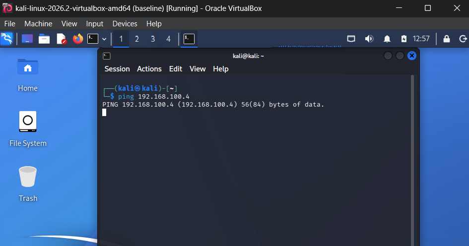
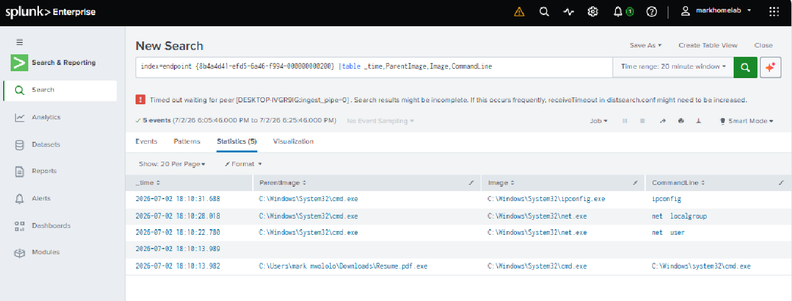

# Cybersecurity Home Lab – Endpoint Detection & Incident Analysis

## Overview
This project documents a self-built home lab used to practice offensive and defensive security fundamentals in an isolated, controlled environment. The goal was to understand how endpoint monitoring tools detect and surface malicious activity — from the attacker's perspective and the defender's perspective — and to build hands-on experience with the type of log analysis performed in a Security Operations Center (SOC).

## Environment
- **VirtualBox** – host for isolated virtual machines
- **Kali Linux** – attack simulation machine
- **Windows 10/11** – target machine
- **Splunk** – SIEM platform for log aggregation and search
- **Sysmon** – Windows system monitoring tool for detailed endpoint telemetry
- **Nmap** – network/port scanning

## Objective
Simulate a realistic attack scenario against an isolated target machine, then use SIEM tooling to detect, trace, and analyze that activity — mirroring the workflow of a SOC Level 1 Analyst.

## Process Summary
1. Configured network communication between the Kali attack machine and Windows target machine.
2. Performed a port scan against the target machine to identify open services.
3. Simulated a controlled malware execution scenario on the isolated target machine.
4. Verified execution on the target using native Windows tools (Task Manager, network connection utilities).
5. Used **Splunk + Sysmon** on the target machine to detect and investigate the resulting activity.
6. Filtered and correlated Sysmon event data — Process ID, Process GUID, timestamps, and Parent-Child process relationships — to trace what occurred on the endpoint.

*Note: This lab was performed entirely within an isolated virtual environment for educational purposes. Specific offensive tooling commands and payload configuration details are intentionally omitted from this write-up.*

## Key Findings
- Sysmon captured granular process-creation telemetry, including parent-child process relationships that revealed suspicious process lineage.
- Splunk's search and filtering capabilities made it possible to quickly isolate relevant events out of the broader event log noise.
- Fields like **Parent Image** and **Process GUID** proved critical for identifying whether a process was spawned in an expected or anomalous way — a key detection technique used in real SOC environments.

## Skills Demonstrated
- SIEM configuration and use (Splunk)
- Endpoint telemetry analysis (Sysmon)
- SPL (Search Processing Language) query writing
- Network reconnaissance fundamentals (Nmap)
- Log correlation and alert triage (SOC Level 1 workflow)
- Virtualized lab environment setup (VirtualBox)

## Screenshots

*Initial communication test between Kali and Windows VMs*

*Port scan results against the target Windows machine*

*Splunk interface showing detected and correlated endpoint activity*

*(Additional screenshots available in the `homelab-images/` folder)*

## Reflection
This lab reinforced how SOC Level 1 analysts triage alerts in practice: pulling up SIEM dashboards, correlating log fields such as process IDs and parent-child relationships, and determining whether activity represents a genuine threat. Being able to reconstruct an attack timeline purely from endpoint telemetry — without having directly observed the activity happen — is a foundational SOC skill, and this exercise provided direct, practical experience building that skill.

## References
- [Home lab setup walkthrough](https://youtu.be/-8X7Ay4YCoA)
