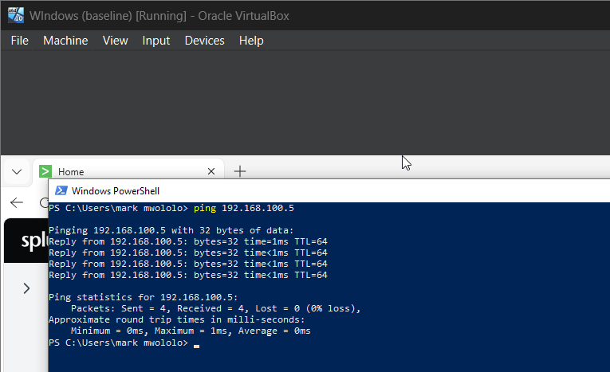
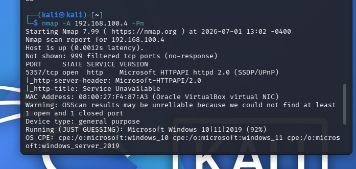
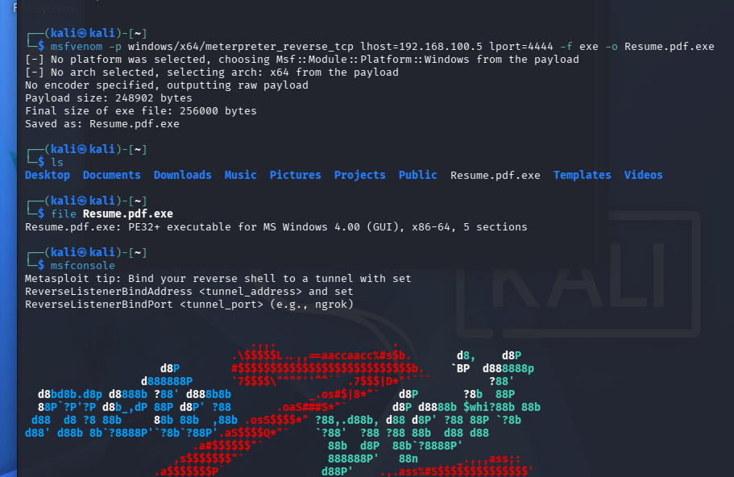
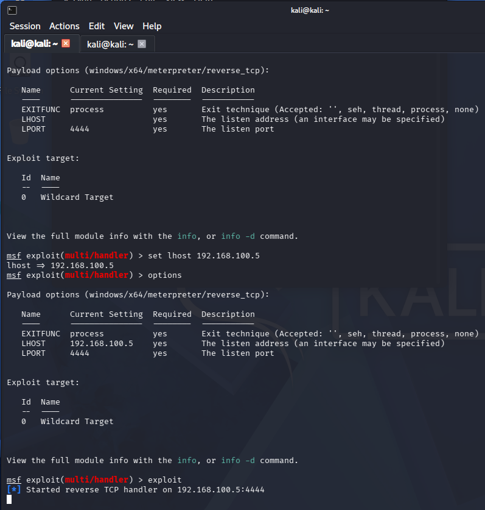
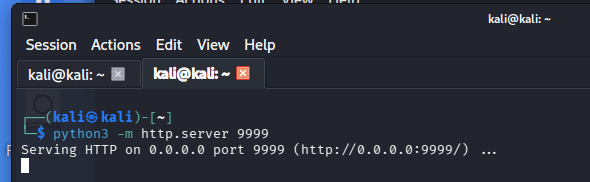
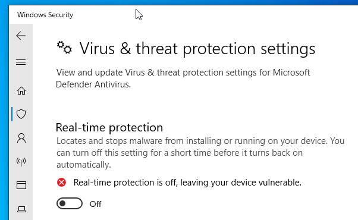
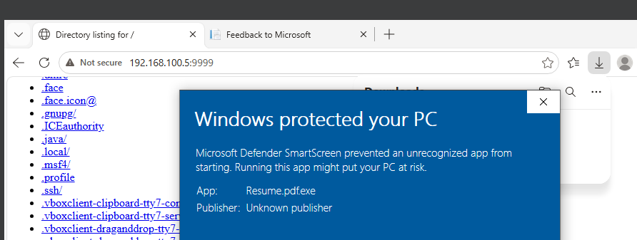
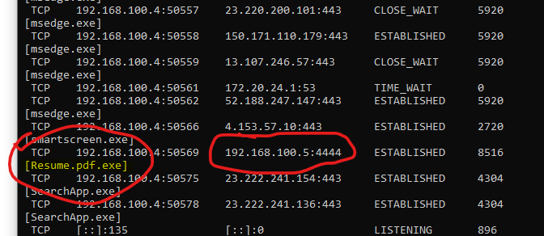
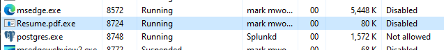
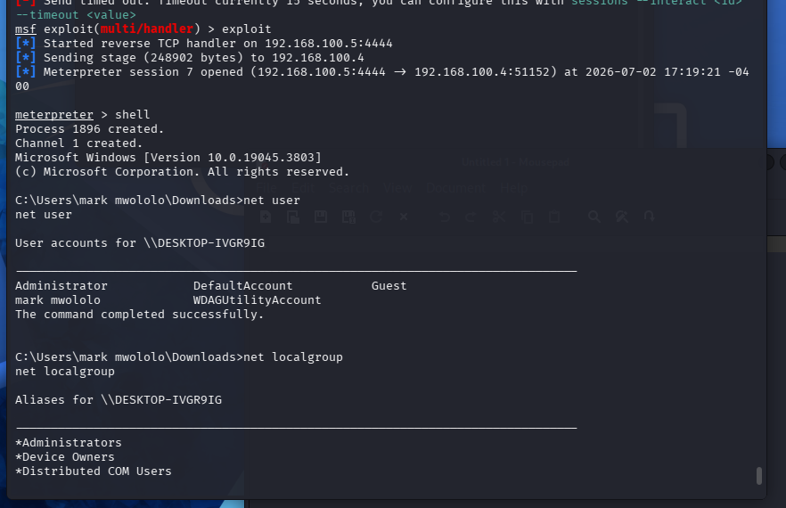

# Cybersecurity Home Lab – Endpoint Detection & Incident Analysis

## Overview
This project documents a self-built home lab used to practice offensive and defensive security fundamentals in an isolated, controlled environment. The goal was to understand how endpoint monitoring tools detect and surface malicious activity — from the attacker's perspective and the defender's perspective — and to build hands-on experience with the type of log analysis performed in a Security Operations Center (SOC).

## Environment
- **VirtualBox** – host for isolated virtual machines
- **Kali Linux** – attack simulation machine
- **Windows 10/11** – target machine
- **Splunk** – SIEM platform for log aggregation and search
- **Sysmon** – Windows system monitoring tool for detailed endpoint telemetry
- **Nmap** – network/port scanning

## Objective
Simulate a realistic attack scenario against an isolated target machine, then use SIEM tooling to detect, trace, and analyze that activity — mirroring the workflow of a SOC Level 1 Analyst.

## Process Walkthrough

**1. Establishing connectivity between VMs**

Before any testing began, I confirmed the Kali attacker VM and Windows target VM could communicate with each other on the isolated lab network, verified from both sides.

**2. Reconnaissance**

I ran a port scan against the target machine to identify open services — standard first-step reconnaissance in any penetration test or red-team exercise.

**3. Preparing a test payload**

I generated a test payload configured to connect back to the attacker machine, saved under a disguised filename to simulate how malware is often masked as a harmless file type.

**4. Setting up a listener**

On the Kali machine, I configured a listener to wait for the target machine to connect once the payload executed.

**5. Hosting the payload for delivery**

I stood up a simple local file server on the attacker machine so the target could retrieve the test payload, simulating a common malware delivery method.

**6. Adjusting target machine security settings for the test**

Since the target machine's built-in protections would normally block the test file, I temporarily adjusted a security setting on the isolated VM to allow the exercise to proceed. This step is specific to controlled lab testing and is not representative of a real-world attacker workflow.

**7. Delivering and executing the payload**

From the target machine, I retrieved the test file from the attacker-hosted server and confirmed it executed successfully — verified using built-in Windows tools like Task Manager and network connection utilities, which showed the disguised process running.

**8. Establishing a remote session**

Back on the Kali machine, the listener picked up the incoming connection, confirming the test payload had executed and "called back" as expected. From here I explored a few basic system-information commands (e.g., checking user accounts and network configuration) to simulate what an attacker might look for during initial post-exploitation reconnaissance.

**9. Detecting the activity in Splunk**

Switching to the Splunk interface — configured with Sysmon on the target machine — I filtered and reviewed the events generated by the test activity. Splunk surfaced the relevant process activity with rich detail: Process ID, Process GUID, timestamps, and Parent-Child process relationships, all of which lined up with the actions taken during the test.

*Note: This lab was performed entirely within an isolated virtual environment for educational purposes. Specific commands, payload configuration values, and exploit tooling syntax are intentionally omitted from this write-up.*

## Key Findings
- Sysmon captured granular process-creation telemetry, including parent-child process relationships that revealed suspicious process lineage.
- Splunk's search and filtering capabilities made it possible to quickly isolate relevant events out of the broader event log noise.
- Fields like **Parent Image** and **Process GUID** proved critical for identifying whether a process was spawned in an expected or anomalous way — a key detection technique used in real SOC environments.

## Skills Demonstrated
- SIEM configuration and use (Splunk)
- Endpoint telemetry analysis (Sysmon)
- SPL (Search Processing Language) query writing
- Network reconnaissance fundamentals (Nmap)
- Log correlation and alert triage (SOC Level 1 workflow)
- Virtualized lab environment setup (VirtualBox)

## Reflection
This lab reinforced how SOC Level 1 analysts triage alerts in practice: pulling up SIEM dashboards, correlating log fields such as process IDs and parent-child relationships, and determining whether activity represents a genuine threat. Being able to reconstruct an attack timeline purely from endpoint telemetry — without having directly observed the activity happen — is a foundational SOC skill, and this exercise provided direct, practical experience building that skill.

## References
- [Home lab setup walkthrough](https://youtu.be/-8X7Ay4YCoA)

